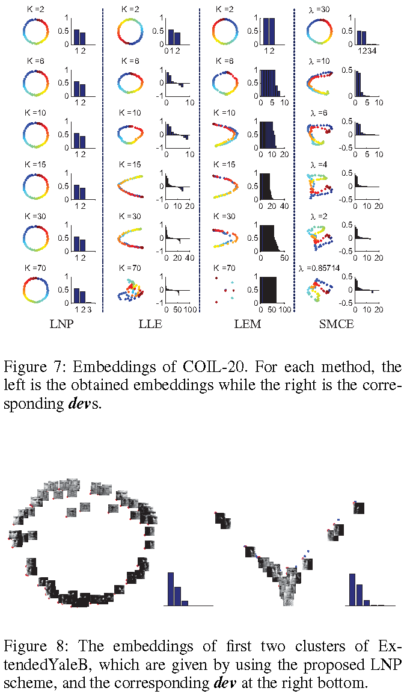

# Locally non-negative pursuit (LNP) method for learning sparse convex representation
This is the official matlab implementation of AAAI'14 paper LNP:

[A local non-negative pursuit method for intrinsic manifold structure preservation](http://legacy.machineilab.org/users/chendongdong/papers/aaai14_lnp.pdf).

By [Dongdong Chen](https://scholar.google.co.uk/citations?user=eIrcIl8AAAAJ&hl=en), Jiancheng Lv, Zhang Yi.

The College of Computer Science, Sichuan University.

If you have questions or find some bugs in the codes, please email to: [dongdongchen.scu@gmail.com](dongdongchen.scu@gmail.com) 

### Table of Contents
0. [Glance](#Glance)
0. [Keywords](#Keywords)
0. [Abstract](#Abstract)
0. [Requirement](#Requirement)
0. [Usage](#Usage)
0. [Citation](#citation)

### Glance
According to the geometric principle, i.e. convex hull of the data points at the local part of the manifold, LNP greedily builds a local minimum convex hull according to the conditions. We prove the data representations calculated on the constructed neighbourhoods are non-negative and k-sparse,  k is selected by LNP and related to the intrinsic dimension of the data manifold.

In summary, the LNP is an iterative algorithm that can (1) learn the non-negative sparse coding WITHOUT any non-negative constraint; (2) learn the low dimensional representations and clusters for data that lie on low-dimensional manifolds; (3) automatically estimate the number of manifolds using the learned sparse non-negative representation. 

### Abstract

The local neighborhood selection plays a crucial role for most representation based manifold learning algorithms. This paper reveals that an improper selection of neighborhood for learning representation will introduce negative components in the learnt representations. Importantly, the representations with negative components will affect the intrinsic manifold structure preservation. In this paper, a local non-negative pursuit (LNP) method is proposed for neighborhood selection and non-negative representations are learnt. Moreover, it is proved that the learnt representations are sparse and convex. Theoretical analysis and experimental results show that the proposed method achieves or outperforms the state-of-the-art results on various manifold learning problems.

#### Keywords

Manifold learning, Neighbors selection, Structure preservation, Sparse convex representation, Dimension reduction.

### Requirement
0. Matlab (>=2011)
0. download the datasets (the duck images are already included in this source))

### Usage
0. To get started, please run the example [/Motivation/NeighborhorSelection_LNP.m](https://github.com/edongdongchen/Locally-Nonnegative-Pursuit/blob/master/Motivation/NeighborhorSelection_LNP.m) by which can illustrate the procedures of selecting neighbours using LNP. It is a lovely example to see how the LNP works.
0. Run the example [/COIL20-duck-experiment/test_coil20_ducks.m](https://github.com/edongdongchen/Locally-Nonnegative-Pursuit/blob/master/COIL20-duck-experiment/test_coil20_ducks.m) on COIL-20. The results show the efficiency of LNP. 
#### The core functions:
0. [lnp_once.m](https://github.com/edongdongchen/Locally-Nonnegative-Pursuit/blob/master/COIL20-duck-experiment/lnp_once.m): given a data point 'b', this function will select the corresponding 'A_opt' from its initial K (big in value) nearest neighborhood (KNN).
0. [affine_rep.m](https://github.com/edongdongchen/Locally-Nonnegative-Pursuit/blob/master/COIL20-duck-experiment/affine_rep.m): given a data point 'b', this function will caculate the affine representation of 'b' over 'A_opt'/'KNN'/or 'A'.
0. [lnp.m](https://github.com/edongdongchen/Locally-Nonnegative-Pursuit/blob/master/COIL20-duck-experiment/lnp.m): given a dataset 'A' (matrix), this function will compute the SCRs (sparse convex representations) for each data point (column in 'A'). 

### Results on COIL20

dev: dimension estimation vector.

### Citation

If you find the codes are useful or used the codes in your research, it is appreciated if you cite:

    @inproceedings{chen2014local,
      title={A local non-negative pursuit method for intrinsic manifold structure preservation},
      author={Chen, Dongdong and Lv, Jian Cheng and Yi, Zhang},
      booktitle={Proceedings of the Twenty-Eighth AAAI Conference on Artificial Intelligence},
      pages={1745--1751},
      year={2014},  
      organization={AAAI}
    }
